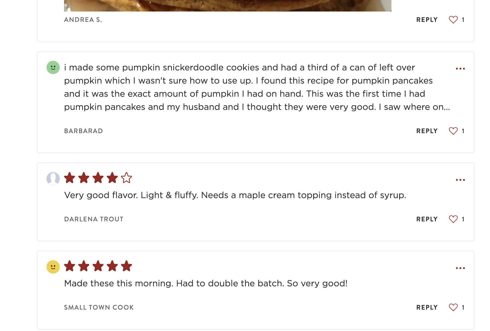
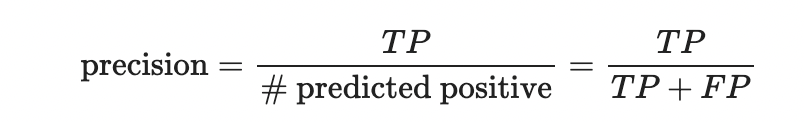
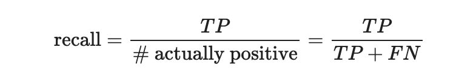
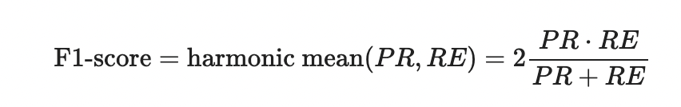

# Classifying Recipe Popularity and Rating with Imbalanced Data 

By Weijie Zhang (wez042@ucsd.edu)

## Project Overview

This data science project aims to explore some of the characteristics of popular and highly rated food recipes. The data comes from food.com and was originally scraped and used by the authors of this recommender system paper.

---

## Table of Contents
1. [Introduction](#Introduction)
2. [Data Clearning and EDA](#data-clearning-and-eda)
3. [Assessment of Missingness](#assessment-of-missingness)
4. [Hypothesis Testing](#hypothesis-testing)
5. [Framing a Prediction Problem](#framing-a-prediction-problem)
6. [Baseline Model: A Simple Approach](#baseline-model-a-simple-approach)
7. [Final Model: Balanced Random Forest & Binary Classification](#final-model-balanced-random-forest--binary-classification)
8. [Fairness Analysis](#fairness-analysis)

---

## Introduction

Nowadays, cooking and sharing recipes online has become widely popular and a significant part of many people’s lives. With the convenience of online recipe platforms like food.com, millions of users benefit from having access to a vast collection of recipes in a variety of culinary. Among all the recipe options available, however, some recipes stand out as both particularly popular and highly rated. 

In this project, we dive into an extensive collection of food recipe data sourced from food.com. The first dataset we are going to use contains food recipes from 2008 to 2018 on food.com, with detailed information about a recipe such as ingredients, preparation times, nutritional values, etc. This dataset contains 83782 observations, meaning that there are 83782 unique recipes in total in our data. The second dataset contains information about users’ review comments and ratings submitted for the recipes in the first dataset. This dataset contains 731927 number of reviews in total submitted by users. Some recipes have lots of reviews while others might have fewer. 

Let’s take a closer look at the information we have. Below is the description of some of the relevant columns in the first dataset:

|      Column      |       Description         |
|------------------|       ------------       |
|   `name`         |       Recipe name         |
|   `minutes`      |       Minutes to prepare food |
|   `submitted`    |       Date recipe was uploaded |
|   `tags`         |       Food.com tags for recipe |
|   `nutrition`    |      Nutrition information for the recipe,   including calories, total fat, sugar, sodium  protein, saturated fat, and carbohydrates |
|   `steps` |  Steps to make the food by the recipe steps    |
|   `description` |   Recipe description    |
|   `ingredients` |      List of ingredients for recipe  |

 

Let’s take a look at the second dataset:

|      Column      |       Description         |
|-----------------|       ------------          |
|   `date`         |       Date reviews was submitted       |
|   `rating`       |       Rating given by the user         |
|   `review`       |       Review comment given by the user |

 

By combining these two comprehensive datasets, we aim to answer the following research questions throughout the project: **What are some of the characteristics of the recipe that are both popular and highly rated? What category does a recipe fall into based on its predicted popularity level and average rating score?**

Category 1: Low review count, low average rating

Category 2: Low review count, high average rating

Category 3: High review count, low average rating

Category 4: High review count, high average rating

Note: we define the threshold for high and low review counts as **10** reviews count and the threshold for high and low average rating scores as **4.8**

 

Through a rigorous analysis of these datasets, we will explore univariate and bivariate relationships between key variables, investigate missing values in the dataset, conduct hypothesis testing to answer the question of interest, build and evaluate a classifier model, and ultimately conduct fairness analysis for the final model. This project will provide valuable insights into understanding the key characteristics of certain recipes that stand out as exceptional and loved by many. 

---

## Data Clearning and EDA

[]

### Data Cleaning 

We will perform the following data cleaning steps to combine and transform our dataset into tidy format, before diving into analysis. 

1. **Convert data type**: We converted the `steps`, `tags`, and `ingredients` columns from the string data type to the list data type. This will help us in accessing each individual element. We also converted the `submitted` column to datatime format. 

2. **Expand the `Nutrition` column**: We expanded the `nutrition` column in the Dataframe such that nutritional information like `calories`, `total fat`, `sugar`, etc is in their individual columns. This allows us to easily access and analyze each quantitative column separately. 

3. **Merge the two datasets into one**: We merged the review dataset into the recipes dataset such that each unique recipe has an average rating and a review list where each element represents a review comment given by a user. We added a new column called `n_review` that counts the number of reviews a recipe has. We will use this information to represent the popularity of the recipe. 

 

After data cleaning, we have the following Dataframe comes in handy for analysis: 

| name |   id | minutes | contributor_id | submitted  | tags  | n_steps | steps  | description  | ingredients | n_ingredients | calories | total_fat | sugar | sodium | protein | saturated_fat | carbohydrates | rating | n_review | reviews   |
|-----------------------------|---------|---------|----------------|------------|------------------------------------------------------------------------------------------------------------------------------------------------------|---------|--------------------------------------------------------------------------------------------------------------------------------------------------------------------------------------------------------------------------------------------------------------------------------------------------------------------------------------------------------------------------------------------------------------------------------------------------------------------------------------------------------------------------------------------------------------------------|-----------------------------------------------------------------------------------------------------------------------------------------------------------------------------|------------------------------------------------------------------------------------------------------------------------------------------------|--------------|----------|-----------|-------|--------|---------|---------------|---------------|--------|----------|----------------------------------------------------------------------------------------------------------------------------------------------------------------------------------------------------------------------------------------------------------------------------------------------------------------------------------|
| 1 brownies in the world    best ever |  333281 |      40 |         985201 | 2008-10-27 | ['60-minutes-or-less', 'time-to-make', 'course', 'main-ingredient']                                                                                 |      10 | ['heat the oven to 350f and arrange the rack in the middle ...                                                                                                                                                                                                                                                                                                                                                                                                                                                                                                            | these are the most; chocolatey, moist, rich, dense, fudgy, delicious brownies ...                                                                                                                                                       | ['bittersweet chocolate', 'unsalted butter', 'eggs', 'granulated sugar']                                                                       |            9 |    138.4 |      10.0 |  50.0 |    3.0 |     3.0 |           19.0 |             6.0 |    4.0 |      1.0 | ['These were pretty good, but took forever to bake ...                                                                                                                                                                                                                                                                            |
| 1 in canada chocolate chip cookies   |  453467 |      45 |        1848091 | 2011-04-11 | ['60-minutes-or-less', 'time-to-make', 'cuisine', 'preparation', 'north-american' ... |      12 | ['pre-heat oven the 350 degrees f, in a mixing bowl ...                                                                                                                                                                                                                                                                                                                                                                                                                                                                                                                | this is the recipe that we use at my school cafeteria for chocolate chip cookies ...                                                                                                                                                       | ['white sugar', 'brown sugar', 'salt', 'margarine', 'eggs']                                                                                      |           11 |    595.1 |      46.0 | 211.0 |   22.0 |    13.0 |           51.0 |            26.0 |    5.0 |      1.0 | ['Originally I was gonna cut the recipe in half (just the 2 of us here) ...                                                                                                                                                                                                                                                     |
| 412 broccoli casserole        |  306168 |      40 |          50969 | 2008-05-30 | ['60-minutes-or-less', 'time-to-make', 'course', 'main-ingredient']                                                                                 |       6 | ['preheat oven to 350 degrees, spray a 2 quart baking dish with cooking spray ...                                                                                                                                                                                                                                                                                                                                                                                                                                                                                     | since there are already 411 recipes for broccoli casserole ...                                                                                                                                                         | ['frozen broccoli cuts', 'cream of chicken soup', 'sharp cheddar cheese']                                                                       |            9 |    194.8 |      20.0 |   6.0 |   32.0 |    22.0 |           36.0 |             3.0 |    5.0 |      4.0 | ['This was one of the best broccoli casseroles that I have ever made ...                                                                                                                                                                                                                                                         |
| millionaire pound cake       |  286009 |     120 |         461724 | 2008-02-12 | ['time-to-make', 'course', 'cuisine', 'preparation', 'occasion', 'north-american']                                                                   |       7 | ['freheat the oven to 300 degrees, grease a 10-inch tube pan with butter ...                                                                                                                                                                                                                                                                                                                                                                                                                                                                                         | why a millionaire pound cake?  because it's super rich ...                                                                                                                                                                              | ['butter', 'sugar', 'eggs', 'all-purpose flour', 'whole milk']                                                                                 |            7 |    878.3 |      63.0 | 326.0 |   13.0 |    20.0 |          123.0 |            39.0 |    5.0 |      1.0 | ['don't let the calories and fat grams scare you off ...                                                                                                                                                                                                                                                                           |
| 2000 meatloaf                |  475785 |      90 |        2202916 | 2012-03-06 | ['time-to-make', 'course', 'main-ingredient', 'preparation', 'main-dish' ... |      17 | ['pan fry bacon , and set aside on a paper towel to absorb excess grease ...                                                                                                                                                                                                                                                                                                                                                                                                                                                                                         | ready, set, cook! special edition contest entry: ...                                                                                                                                                                                     | ['meatloaf mixture', 'unsmoked bacon', 'goat cheese', 'unsalted butter']                                                                        |           13 |    267.0 |      30.0 |  12.0 |   12.0 |    29.0 |           48.0 |             2.0 |    5.0 |      2.0 | ['Delicious!!!!! -- the goat cheese made the difference ...                                                                                                                                                                                                                                                                       |

---

### Univariate Analysis

In the univariate analysis, we will look at the distribution of the calories and the distribution of the rating in food recipes in the dataset. 

 

#### Distribution of Calories

<iframe src="figures/uni_var_1.html" width=800 height=600 frameBorder=0></iframe>

(This is a histogram of the distribution of the calories of food recipes in the dataset.)

We only included 98% of the data values from the `calories` column for better visualization. From looking at the histogram, we see that most of the calorie values range from 0 to 1000, with fewer data values towards the right side of the plot. The distribution shows right-skewness, indicating that a significant proportion of food recipes fall within a typical calorie range, with some recipes featuring higher calorie counts.

---

#### Distribution of Rating

<iframe src="figures/uni_var_2.html" width=800 height=600 frameBorder=0></iframe>

(This is a histogram of the distribution of the rating of food recipes in the dataset.)

As we look at the histogram, the majority of recipes have an average rating above 3.0, with only a very small minority falling below this threshold. If we want to develop a classification model to distinguish recipes based on good and bad ratings, we must address the issue of **imbalanced data**. This is something we should consider when building our final classification model. 

---

### Bivariate Analysis

For bivariate analysis, we will look at the relationship between sugar percent daily value and rating range, as well as, calories percent daily value and the number of ingredients in food recipes in the dataset. 

 

#### Sugar vs. Rating

<iframe src="figures/bi_var_1.html" width=800 height=600 frameBorder=0></iframe>

(This is a box plot featuring the relationship between rating and sugar percent daily value in food recipes in the dataset.)

In crafting this box plot, we only incorporated 95% of the data values from the `sugar` column to exclude extreme values and grouped ratings into bins for better visualization. As we look into the box plot, we note a slight upward trend in the sugar daily level for the recipes as the average rating decreases, particularly in the third quarter and the upper fence. This observation suggests a potential **negative correlation between the sugar content and the average rating in recipes**, indicating that low sugar content might tend to receive higher ratings, and vice versa. 

---

#### Calories vs. Number of Ingredients

<iframe src="figures/bi_var_2.html" width=800 height=600 frameBorder=0></iframe>

(This is a scatter plot featuring the relationship between calorie percent daily value and the number of ingredients in food recipes in the dataset.)

In making this visualization, we only included 99% of the data value for the `calories` column to exclude extreme values, grouped ratings into bins, and introduced random noise to the `n_ingredients` column, which represents a discrete variable, for better visualization. From examining the scatter plot, we see that there exists a **week positive correlation between the calorie daily level and the number of ingredients in recipes**. This finding aligns with our expectation that using a variety of ingredients in a recipe would likely result in higher calorie content in food.

---

### Data Aggregation

So far, we only looked at the overall distribution of one variable and the bivariate distribution of two variables. For a better understanding of our data, we construct the following pivot table that shows the aggregated distribution of quantitative variables by mean, conditional on the number of ingredients. As we examine each column of the pivot table from top to bottom, we can observe a consistently increasing trend in various quantitative variables such as `calories`, `carbohydrates`, `minutes`, `n_steps`, `protein`, `saturated_fat`, `sodium`, and `total_fat`, as the number of ingredients increases in food recipes. This suggests that `n_ingredients` might have a positive correlation with these quantitative variables. 

The pivot table is shown below (number is rounded to 3 decimal places and only showin the first and last 5 line )

|   n_ingredients |   calories |   carbohydrates |   minutes |   n_steps |   protein |   saturated_fat |   sodium |    sugar |   total_fat |
|----------------|-----------|----------------|----------|----------|----------|----------------|---------|---------|------------|
|               1 |    288.77  |          10.2   |    47.6   |     7.3   |    10.8   |          25     |   12.9   | 100.1   |      21.8   |
|               2 |    238.312 |           8.728 |    56.131 |     5.711 |    13.18  |          18.211 |    7.699 |  62.322 |      15.27  |
|               3 |    233.924 |           8.413 |    42.754 |     5.485 |    13.873 |          19.791 |   10.844 |  55.622 |      15.406 |
|               4 |    263.534 |           9.084 |    40.107 |     6.135 |    16.943 |          24.627 |   12.858 |  60.599 |      18.164 |
|               5 |    282.587 |           9.288 |    49.087 |     7.104 |    19.914 |          26.891 |   15.712 |  54.497 |      20.726 |
|   ... |   ... |   ... |   ... |   ... |   ... |   ... |   ... |    ... |   ... |
|              29 |    886.3   |          34     |    86.222 |    21.222 |    78     |          72.333 |   59.444 | 141.778 |      60     |
|              30 |    631.656 |          17.333 |   116.667 |    20     |    55.222 |          62.222 |   51     |  41.222 |      53.222 |
|              31 |    502.05  |          14.667 |   197.5   |    22.333 |    47.667 |          45     |   46.5   |  44.667 |      39.833 |
|              32 |    697.35  |          18.5   |    55     |    34     |    66     |          87.5   |   53     |  30.5   |      58.5   |
|              33 |    338.2   |          14     |    35     |     6     |     8     |          12     |   16     |  18     |      25     |

 

To get a visual representation of the above data, we have converted the pivot table to a series of line plots as below. 

<iframe src="figures/agg.html" width=800 height=600 frameBorder=0></iframe>

As we can see from the line plots above which illustrates the relationship between the number of ingredients and various other quantitative columns such as `calories`, `carbohydrates`, `minutes`, `n_steps`, `protein`, `saturated_fat`, `sodium`, and `total_fat`, we can observe clear and consistent increasing trends across all plots, aligns with our observation from the pivot table. These findings suggest a positive correlation between the number of ingredients and these quantitative variables, indicating that, on average, having more ingredients included in a food recipe corresponds to higher nutritional values, more preparation time, and a greater number of steps. 

---

## Assessment of Missingness

### Not Missing At Random (NMAR) Analysis 

We believe that the missing values in the `rating` column are not Not Missing at Random (**NMAR**), meaning that the chance of a value being missing **depends on the actual missing values themselves.** Updon browersing from the food.com website, we found that there are certain reviews given by users without ratings in the comment section of a recipe (showing in the image below). This is the case in which users opt to provide a review comment, without giving a rating score to the recipe. Therefore, during the data generation process, this result in certain recipes having missing rating score values.

---

### Missingness Dependency Analysis

Besides the `rating` column, we also found missing values in `description` column. We hypothesize that the missingness of `description` is **Missing at Random (MAR)**, meaning that the chance of a value being missing **depends on some other columns**. We will investigate the missing dependency of `description` using permutation test. 

We hypothesize that the missingness of `description` column depends on the `sugar` column, meaning that there is some systemic difference between the distribution of sugar for those recipes missing the description and those that do not. 

 

Set up:

**Does the missingness of `description` depend on the `sugar` column?**

**Null Hypothesis**: the missingness of `description` does not depend on `sugar`. 

**Alternative Hypothesis**: the missingness of `description` does depend on `sugar`.

**Significance Level**: 0.05

Let's look at the distribution of `sugar`, conditional on the missingness of `description` column. 

<iframe src="figures/miss_dist_1.html" width=800 height=600 frameBorder=0></iframe>

Based on the plot above, the orange line represents the distribution of sugar when `description` is not missing, while the blue line represents the distribution of sugar when `description` is missing. We can see that these two distributions of sugar, conditional on the missingness of `description`, looks quite difference. To quantify this difference, we decide to use Kolmogorov-Smirnov (K-S) statistic instead of the absolute difference of means. Therefore, we will use **K-S statistics** as our test statistics for the permutation test.

We shuffle the missingness of description 1000 times and get 1000 simulated K-S test statistics of `sugar` column during the permutation test. The permutation result is shown as below. 

<iframe src="figures/miss_perm_1.html" width=800 height=600 frameBorder=0></iframe>

From the plot above and result of the permutation test, the 0.05% significance level of the simulated statistics is 0.16 and our observed test statistics 0.18, which is greater that the values of the significance level. The p-value is 0.019, which is less than the significance level of 0.05. So we **reject the null hypothesis.**

Thus, we conclude that **the missingness of `descrpition` likely depends on the `sugar` column.**

---

We hypothesize that the missingness of `description` column does not depend on the `calorie` column, meaning that the distribution of calorie when `description` is missing and the distribution of calorie when `description` is not missing are alike, any difference is due to random chance. 

 

Set up:

**Does the missingness of `description` depend on `minutes` column?**

**Null Hypothesis**: the missingness of `description` does not depend on `minutes`. 

**Alternative Hypothesis**: the missingness of `description` does depend on `minutes`.

**Significance Level**: 0.05

Let's look at the distribution of `minutes`, conditional on the missingness of `description` column. 

<iframe src="figures/miss_dist_2.html" width=800 height=600 frameBorder=0></iframe>

Based on the plot above, the orange line illustrates the distribution of minutes when `description` is not missing, while the blue line illustrates the distribution of minutes when `description` is missing. Desipte both distribution have similar shape, they are centered in smiliar location. Using difference in mean may not effectively capture this difference in distribution. So we decide to use Kolmogorov-Smirnov (K-S) statistic as our test statistics for the permutation test.

We shuffle the missingness of description 1000 times and get 1000 simulated K-S test statistics of `minutes` column during the permutation test. The permutation result is shown as below. 

<iframe src="figures/miss_perm_2.html" width=800 height=600 frameBorder=0></iframe>

From the plot above and result of the permutation test, the 0.05% significance level of the simulated statistics is 0.15 and our observed test statistics 0.1, which is smaller that the values of the significance level. The p-value is 0.408, which is greater than the significance level of 0.05. So we **fail to reject the null hypothesis.**

Thus, we conclude that **the missingness of `descrpition` likely depends on the `minutes` column.**

---

## Hypothesis Testing

The question we are going to explore and reasearch in this section is the following: **Do popular recipes (those with high review count) have a lower sugar level compared to less popular ones (those with low review count)** 

Recall that we define high review count threshold as having more than **10** reviews. We will conduct a permutationt test to see if the distribution of sugar level for popular recipes and the distribution of sugar level for not popular recipes are similar. 

 

Set up:

**Null Hypothesis**: Receipes with a high review count do not have a lower sugar levels than those with low review count. Any observed differences in our samples are merely due to random chance.

**Alternative Hypothesis**: Recipes with high review count indeed have a lower sugar level than those with a low review count. The observed difference observed in our samples cannot be explained by random chance alone.

**Test Statistics**: Since our variable of interest is numerical and our test is one-tail test, signifying a directional alternative hypothesis, we will use difference in mean as our test statistics for the permutation test.

**Significance Level**: 0.05

 

We created a new column called `is_popular` which is true if the recipe has reivew count more than 10, and false otherwise. 

This is a sample of the dataframe that we are going to perform permutation test on. 

|       |   sugar  | is_popular  |
|------ |-------- |------------- |
|  1092 |      36 | False        |
| 44285 |       4 | False        |
| 60708 |      18 | False        |
| 56138 |      48 | False        |
|   628 |       0 | True         |

 

We shuffle the `is_popular` 1000 times and get 1000 simulated difference in mean test statistics of `sugar` column during the permutation test. The emperical distribution of permutation test result is shown as below. 

<iframe src="figures/hyp.html" width=800 height=600 frameBorder=0></iframe>

**P-value**: 0.0

From looking at the graph above, we can see that our observed difference in mean, which is 14.58, is greater than the significance level of simulated difference in mean, which is 6.05, suggesting that the observed statistics in our sample are not merely coincidental. Furthermore, the p-value obtained from our permutation testing is 0.0, which falls below our significance level of 0.05. Therefore, we **reject our null hypothesis** and in favor of our alternative hypothesis: recipes with high review counts likely have a lower sugar level compared to those with low review counts.

The result can be reasonable that people might like to give high rating to recipes with lower sugar content in food, and food with a lower sugar level is considered more healthy. 

---

## Framing a Prediction Problem

Recall from the introduction that we are interesting in the following problem:

**What category does a recipe fall into based on its predicted popularity level and average rating score?**

Category 1: Low review count, low average rating

Category 2: Low review count, high average rating

Category 3: High review count, low average rating

Category 4: High review count, high average rating

Note: we define the threshold for high and low review counts as **10** reviews count and the threshold for high and low average rating scores as **4.8**

Specifically, we want to classify recipes into the above 4 categories based on all other information we have. 

 

The prediction problem we are addressing is a **multi-class classification** problem since our goal is to classify recipes into one of four distinct categories. These class categories are determined by two other variables `rating` which categorizes recipes based on their average rating and `n_review` which categorizes recipes based on the number of reviews it has. Thus, recipes are classified as a combination of either having a low review count or a high review count, and either a low average rating or a high average rating, resulting in four unique class labels.

 

To generate features for our classification model, the variables we will be using are all other columns except `rating` and `n_review` since these two variables are used to create the class categories. These are the features we are available at the time of prediction for classifying recipes based on popularity and average rating. 

The key metrics we will be using for evaluating our classifier model performance are **accuracy, precision, recall, and f1-score**:

 

- **Accuracy** represents the proportion of correctly classified instances among all observations. It tells us the overall performance of how the model classifies recipes into each category. However, accuracy does not tell the full story, especially when dealing with imbalanced data.

 

- **Precision** measures the proportion of the predicted positive instances that are correctly classified. It tells us how good the model is at avoiding false positive predictions. In our content, a false positive occurs when low-rating recipes are mistakenly classified into high-rating categories. A high precision minimizes the occurrence of such misclassification. 

 

- **Recall** measures the proportion of the actual positive instances that are correctly classified. It tells us how good the model is at identifying all the positive instances that are present, without missing too many of them. In our context, it reflects the model’s ability to correctly classify all high-rating recipes into the high-rating categories. A high recall maximizes the occurrence of the correct classification. 

 

- **F1-score**, being the harmonic mean of precision and recall, provides a balanced summary of the model’s predictive power, considering both predicted positive and actual positive. 

---

## Baseline Model: A Simple Approach

We split our data to training and testing set by stratifing using the class label. The training set consititue 80% of our data while the testing has the reamining 20% of our data. We will use testing set to evalute the ability of our model to generalize to unseen data.:

    X_train, X_test, y_train, y_test = train_test_split(recipe.drop(['class', 'rating', 'n_review'], axis=1), 
                                                        recipe['class'], test_size=0.2, stratify=recipe['class'])

---

### Feature Engineering

We perform the following feature engineering steps to transform our vairables before fitting into our model. We use RobustScaler instead of StandardScaler on most numerical column because there exist extreme values in those columns. RobustScaler use the median instead of the mean while scaling the data. 

 

**Quantative Feature**:

`minutes`, `protein`, `sodium`, `saturated_fat`, `total_fat`, `carbohydrates`
- Type: quantative continuous
- Feature Transformation: use RobustScaler to reduce the impact of outlier

`n_steps`, `n_ingredients`
- Type: quantative discrete
- Feature Transformation: passthrough

`time`
- Type: quantative
- Feature Transformation: extract year, month, and day from `submitted` timestamp column

 

**Categorical Feature**:

`calories`, `sugar`
- Type: quantative to nominal
- Feature Transformation: cateogrize calories and sugar into 8 bins and do one-hot encoding

`recipe_complexity`
- Type: nominal
- Feature Transformation: binarize `n_steps` and `n_ingredients` using the threshold of 10 to represent recipe complexity

We choose to build features from the above columns as we believe these features might have some relationship for predicting recipe's popularity and average rating. 

---

### Baseline Model Building and Performance Evaluation

For Baseline Model, we decide to use the Random Forest model for our classification problem. 

The main idea of Random Forest algorithm is to Fit *n* number of decision trees by using bagging and a random subset of features at each split. Predict by taking a vote from those *n* decision trees. It is the idea of Ensemble Learning.

 

Here is a pipeline of our baseline model, in which we transform our column first, then fit into RandomForestClassifier. 

    Pipeline(steps=[('col_trans',
                     ColumnTransformer(transformers=[('outlier', RobustScaler(),
                                                      ['minutes', 'protein',
                                                       'sodium', 'saturated_fat',
                                                       'total_fat',
                                                       'carbohydrates']),
                                                     ('pass', 'passthrough',
                                                      ['n_steps', 'n_ingredients']),
                                                     ('to_bin',
                                                      Pipeline(steps=[('outlier',
                                                                       RobustScaler()),
                                                                      ('to_bins',
                                                                       KBinsDiscretizer(n_bins=8))]),
                                                      ['calories', 'sugar']),
                                                     ('time',
                                                      Pipeline(steps=[('time',
                                                                       FunctionTransformer(func=<function <lambda> at 0x2b514b550>))]),
                                                      ['submitted']),
                                                     ('complexity',
                                                      Pipeline(steps=[('complex',
                                                                       FunctionTransformer(func=<function recipe_complexity at 0x2b5056ee0>))]),
                                                      ['n_steps',
                                                       'n_ingredients'])])),
                    ('clf', RandomForestClassifier())])

 

After fitting our training data into the baseline model, we evalute our model using testing data. The confusion matrix below is the result of the prediction of testing data. 

<iframe src="figures/base_confus.html" width=800 height=600 frameBorder=0></iframe>

By looking at the confusion matrix, we can see that the baseline model misclassifies lots of recipe into class lable 1 and 2. In addition, it have difficult in accurately classifying recipes into class label 3 and 4, which correspond to high review counts. This is caused by the imbalanced nature of class label in our dataset. **Recipes with high review counts are relatively rare and constitute a minority group of data**, whereas recipes with low review count are more prevalent and make up a majority of the data. This is something we will address in building our final model. 

Result of counting all the class lable in our dataset, showing imbalanced data:

    2    48979
    1    28825
    4     1834
    3     1535
    Name: class, dtype: int64

 

Let's look at the precision, recall, and f1-score of our baseline model for predicting unseen data. 

|            | precision | recall | f1-score | support |
|------------|-----------|--------|----------|---------|
|   1        |   0.42    |  0.13  |   0.20   |  5765   |
|   2        |   0.61    |  0.91  |   0.73   |  9796   |
|   3        |   0.00    |  0.00  |   0.00   |   307   |
|   4        |   0.00    |  0.00  |   0.00   |   367   |
|accuracy    |           |        |   0.59   | 16235   |
|macro avg   |   0.26    |  0.26  |   0.23   | 16235   |
|weighted avg|   0.52    |  0.59  |   0.51   | 16235   |

We see that the model has 0 precision, recall, and f1-score for class label 3 and 4 while it has a high f1-score for class label 2 since most recipes belongs to class 2. Our model accuracy is 59%. Overall, the performane of our baseline model is not as good as we thought so since it has difficult in identifying popular recipes, which are something we are more interested in. We will improve our baseline model to correctly classify more popular recipes. 

---

## Final Model: Balanced Random Forest & Binary Classification

As usual, we will us the same training and testing data from baseline mode. 

#### Feature Engineering

**The following features are from the baseline model**

`minutes`, `protein`, `sodium`, `saturated_fat`, `total_fat`, `carbohydrates`
- Type: quantative continuous
- Feature Transformation: use RobustScaler to reduce the impact of outlier

`n_steps`, `n_ingredients`
- Type: quantative discrete
- Feature Transformation: passthrough

`time`
- Type: quantative
- Feature Transformation: extract year, month, and day from `submitted` timestamp column

`recipe_complexity`
- Type: nominal
- Feature Transformation: binarize `n_steps` and `n_ingredients` to represent recipe complexity

 

**The following text features are added for the final model:**

`description`
- Type: text data
- Feature Transformation: 
 - Build a list of vocabulary from high Inverse Document Frequency(IDF) words from the `description` of **high reivew count recipes** (minority class label, class 3 and 4)
 - Vectorize the description text column using TF-IDF and the vocabulary from previous step
 - For each recipe, extract the top 5 highest TF-IDF values as the features

`steps`
- Type: text data
- Feature Transformation: 
 - Build a list of vocabulary from high Inverse Document Frequency(IDF) words from the `steps` of **high reivew count recipes** (minority class label, class 3 and 4)
 - Vectorize the steps text column using TF-IDF and the vocabulary from previous step
 - For each recipe, extract the top 5 highest TF-IDF values as the features 

We believe that incorporating `description` and `steps` feature can improve our model's ability to identify recipes with high review counts since we built a vocabulary from those recipes and use TF-IDF to extract important text information. While there is a potential risk of data leakage since we use the class label to build feature, our approach to using the class label is indirect and we only use the training data to build vocabulary. We believe it is appropraite to use these text feature in our final model. 

 

Simple sentiment analysis on `reviews` column:

`reviews`
- Type: text data
- Feature Transformation:
 - Manaually create a list of sentiment words such as `good`, `loved`, `hated`, etc that are relevant for extracting sentiment information
 - For each word in sentiment word list, binarize `reviews` based on whether there are enough review comments that contain that particular word
 
We think that adding this sentiment analysis on `reviews` feature can as well improve our model's ability to distinguish recipes between high average rating and low average rating by the simple logic that high rating recipes often have more positive words while low rating recipe often have more negative words. 

---

### Final Model Building

The approach we aim to use for our final model is to decompose our multi-class classification problem into two distinct binary classification problems. We will construct two separate classification models, one to determine whether a recipe has a high or low review count, and another to determine whether a recipe has a high or low average rating. Subsequently,  we will combine the outcomes of these two binary classifiers to generate the four different class labels corresponding to the result of our multi-class classification problem.

We observed previously that there is a severe data imbalance issue in classifying recipes based on review count, where the low review count category represents the majority class, while the high review count category represents the minority class. To address this imbalance, the model we are going to use is the **BalancedRandomForest** algorithm from the imbalanced-learn library. Unlike the standard random forest implemented in sklearn, balanced random forest us bootstrapping to sample from the minority class and randomly selects the same number of samples with replacement from the majority class while constructing each decision tree. This approach will help our model’s ability to have a higher precision in classifying the minority class. 

A simple model construction of our idea:

    class ClassificationTransformer(BaseEstimator, TransformerMixin):

        def __init__(self, model_1, model_2):
            self.model_1 = clone(model_1)
            self.model_2 = clone(model_2)

        def fit(self, X, Y):
            self.model_2.fit(X, Y[1])
            self.model_1.fit(X, Y[0])

            return self

        def predict(self, X):
            y_1 = self.model_1.predict(X)
            y_2 = self.model_2.predict(X)
            
            # combine the outcome of y_1 and y_2 
            ...
            
            return y

 

Model pipeline: 

    Pipeline(steps=[('col_trans',
                     ColumnTransformer(transformers=[('outlier', RobustScaler(),
                                                      ['minutes', 'protein',
                                                       'sodium', 'saturated_fat',
                                                       'total_fat',
                                                       'carbohydrates']),
                                                     ('pass', 'passthrough',
                                                      ['n_steps', 'n_ingredients']),
                                                     ('time',
                                                      Pipeline(steps=[('time',
                                                                       FunctionTransformer(func=<function <lambda> at 0x2b514b550>))]),
                                                      ['submitted']), ...])),
                    ('clf',
                     ClassificationTransformer(model_1=BalancedRandomForestClassifier(class_weight='balanced',
                                                                                      criterion='entropy',
                                                                                      max_depth=16,
                                                                                      n_estimators=180),
                                               model_2=RandomForestClassifier(class_weight='balanced',
                                                                              criterion='entropy',
                                                                              max_depth=19,
                                                                              n_estimators=150)))])

We use standard random forest to classify recipes based on average rating and use balanced random forest to classify recipes based on review counts, since it has more imbalanced data. 

---

### Hyperparameter Tunning

We manually iterative through a list of hyperparameter with stratified 5-fold trian-test split seperately for our two classifier models to find the best hyperparameter for model accuracy. We found the best `max_depth` hyperparameter to be 16 and 19 and the best `num_estimators` hyperparameter to be 180 and 150 for balanced ranfom forest and standard random forest, respectively, as seen in our pipeline above. 

---

### Model Performance Evaluation

After fitting our training data into the final model, we evalute our model using testing data. The confusion matrix below is the result of the prediction of testing data. 

<iframe src="figures/final_confus.html" width=800 height=600 frameBorder=0></iframe>

As seen in the confusion matrix, our final model has correctly classified a considerable amount of minority class label, class 3 and 4, which is overall an improvement to the baseline model. 

 

Let's look at the precision, recall, and f1-score of our final model for predicting unseen data.

|            | precision | recall | f1-score | support |
|------------|-----------|--------|----------|---------|
|   1        |   0.59    |  0.47  |   0.53   |  5765   |
|   2        |   0.74    |  0.73  |   0.73   |  9796   |
|   3        |   0.19    |  0.55  |   0.29   |   307   |
|   4        |   0.19    |  0.59  |   0.29   |   367   |
|accuracy    |           |        |   0.63   | 16235   |
|macro avg   |   0.43    |  0.58  |   0.46   | 16235   |
|weighted avg|   0.66    |  0.63  |   0.64   | 16235   |

Although the precision for class 3 and 4 are relatively low, their recall are high, which means that **our model is good at capturing all the high reiview count recipes, without missing too many of them, but at the same time, it makes too many false positive, misclassify low review count recipes into high review count categories.** The trade off is acceptaible. The accuracy of our final model is 63%, which is better than our baseline model. Overall, our final model is an improvement over the baseline model. 

 

<iframe src="figures/final_feature.html" width=800 height=600 frameBorder=0></iframe>

We can gain insights into our model's feature importance by visualization. Feature importance highlights the extent to which our engineered feature contributes to help the model's classification decision. A higher importance score indicates that the feature plays a more significant role in classifying recipes. We can see from the plot that certain features have a very high importance to the model. Specifically, the `review` feature corresponds to features numbered from 21-50. Recall that we use a list of manually created sentiment words for simple sentiment analysis. The result of the visualization above indicates that certain sentiment words are particularly useful in helping the model to make accurate predictions. 

Below, we present the top 10 most useful sentiment words for feature engineering in our classification model:

    1        great
    2         good
    3         very
    4    delicious
    5         made
    6          but
    7        loved
    8      perfect
    9        would
    10    wonderful

--- 

Finally, we fit our final model using all availbale data and ship to production for fairness analysis. 

    final_model = pl_clf.fit(
        recipe.drop(['class', 'rating', 'n_review'], axis=1),
        [to_n_review(recipe['class']), to_rating(recipe['class'])])

--- 

## Fairness Analysis

For fairness analysis, we are interested in this question: **“Are recipes with `vegetarian` tags more likely to be correctly classified as to the high average rating category by the model, compared to those without the `vegetarian` tags?”** Are our model fair in terms of precision?

To evaluate fairness, we will compare the **precision** acorss two distinct groups. Specifically, we will compare the precision score for recipes with the 'vegetarian' tag against those without it. If the precision for recipes with the `vegetarian` tag is statistically significantly higher than the precision for recipes without it, it could potentially indicate a bias towards classifying `vegetarian` recipes as high average rating more frequently, even when they should not be classified as such. In our dataset, a high average rating corresponds to class categories 2 and 4. 

 

Setup:

**Null Hypothesis**: Our model is fair. Our classifier's precision is the same for recipes with and without `vegetarian` tag, and any differences are due to random chance.

**Alternative Hypothesis**: Our model is not fair. Our classifier's precision is higher for recipes with `vegetarian` tag than those without, and any observed differences can not be explained by random chance alone.

**Test statistic**: Difference in average precision of class 2 and 4 (without `vegetarian` tag - with `vegetarian` tag).

**Significance level**: 0.05.

 

We fitted our final model with all available and created a new column `has_tags_vegetarian` that indicates if the recipes has `vegetarian` tag. 

We then shuffle the `has_tags_vegetarian` 1000 times and get 1000 simulated difference in average precision test statistics for recipes with and without `vegetarian` tag during the permutation test. The emperical distribution of permutation test result is shown as below. 

<iframe src="figures/fair.html" width=800 height=600 frameBorder=0></iframe>

From the graph above, we can see that the observed difference in precision falls below the significance level of 0.05, suggesting that the observed statistics in our sample are likely by random chance alone. The p-value we obtained from performing our permutation testing is approximately 0.403, which is greater than our significance level of 0.05. Therefore, we **fail to feject our null hypothesis** that the precision of our classifier is likely around the same for recipes with and without `vegetarian` tag, and any observed differences are due to random chance. Our model **achieves precision parity** across groups with and without `vegetarian`tag. 

[Back to the Top](#table-of-contents)

